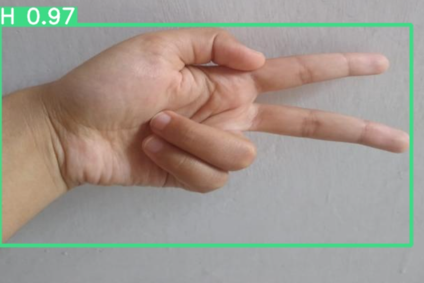

# Sign Language Recognition A–Z (YOLOv9)

A deep learning project that recognizes American Sign Language (ASL) hand signs from A to Z using **YOLOv9**, trained on a personally collected dataset of 4000+ images. Model training and inference are performed on **Google Colab**, with annotations managed via Roboflow.

---

## Features

- Recognizes A–Z hand signs
- 4000+ hand images (custom dataset)
- Annotated with Roboflow
- Powered by YOLOv9 for real-time detection
- Google Colab notebook for easy training/inference
- High accuracy on personalized data

---

## Sample Output

  
  

---

## Dataset

- Custom dataset of 4000+ images of hand gestures
- Labeled using [Roboflow](https://roboflow.com/)
- The dataset is **not included** due to size.

---

## How It Works

1. Collect hand sign images for A–Z within different conditions
2. Annotate using Roboflow
3. Export dataset in YOLO format
4. Use YOLOv9 in Colab for training
5. Run inference with webcam or images

---

## Tech Stack

| Component         | Tool/Library         |
|-------------------|----------------------|
| Language          | Python               |
| Model             | YOLOv9               |
| Annotation        | Roboflow             |
| Training/Inference| Google Colab         |
| Visualization     | OpenCV / Matplotlib  |

---

## Author

Built by **Mariyam Chauhdry** – AI Engineer  
Feel free to connect with me on [LinkedIn](https://www.linkedin.com/in/mariyam-chauhdry-592231270)
